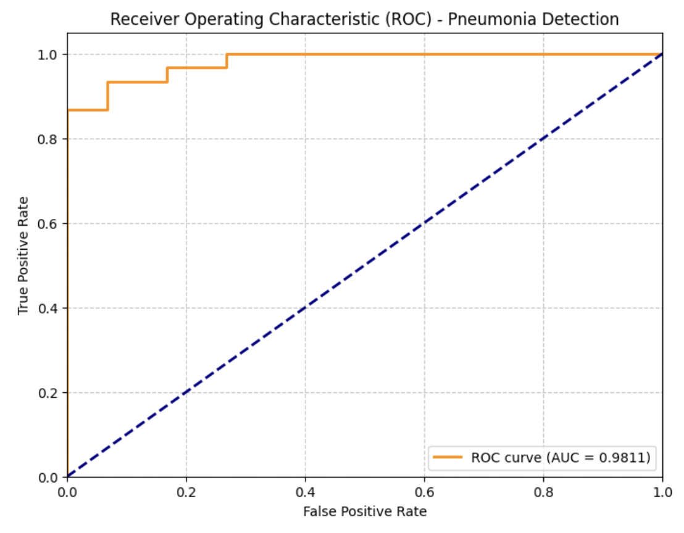
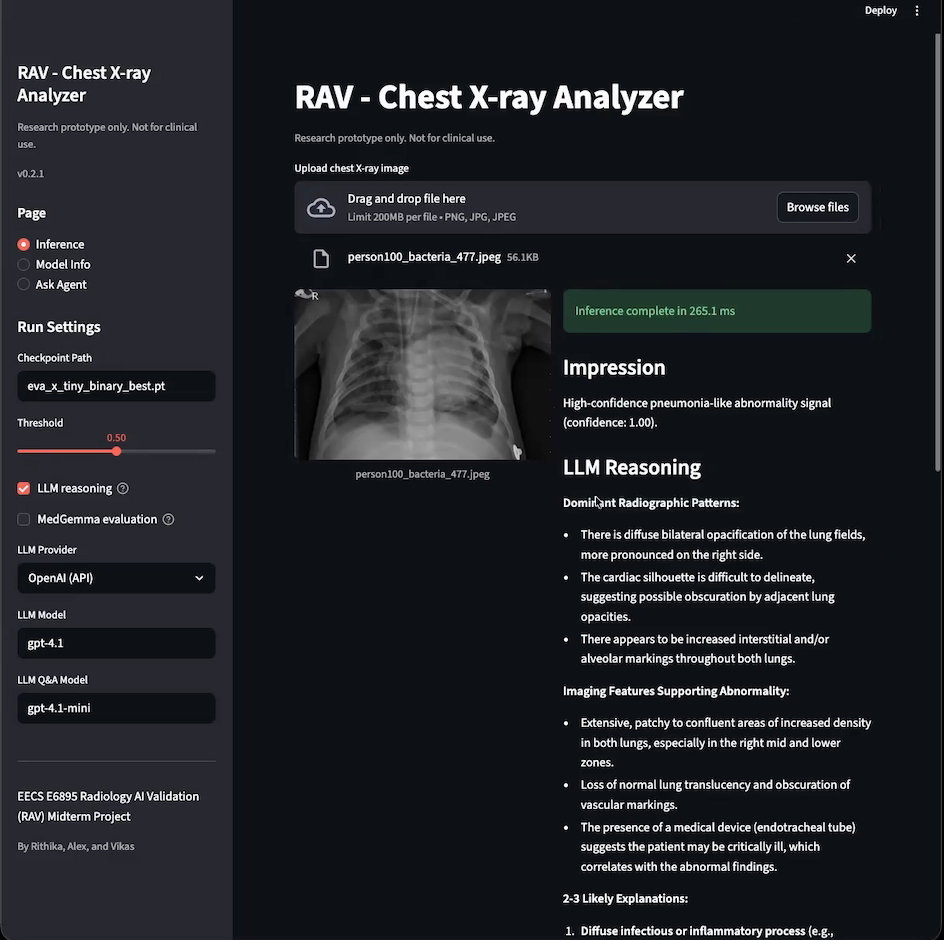
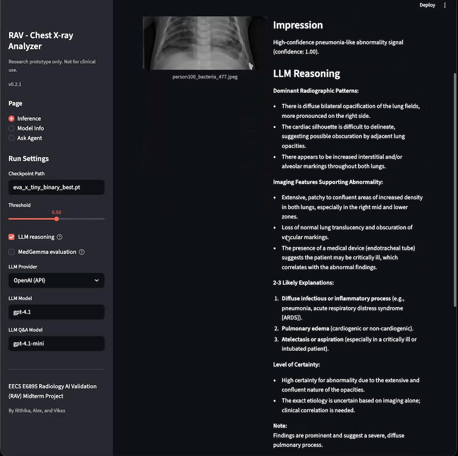
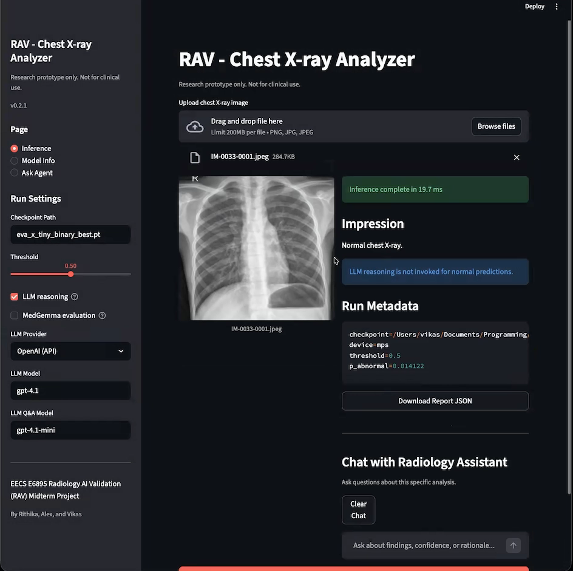
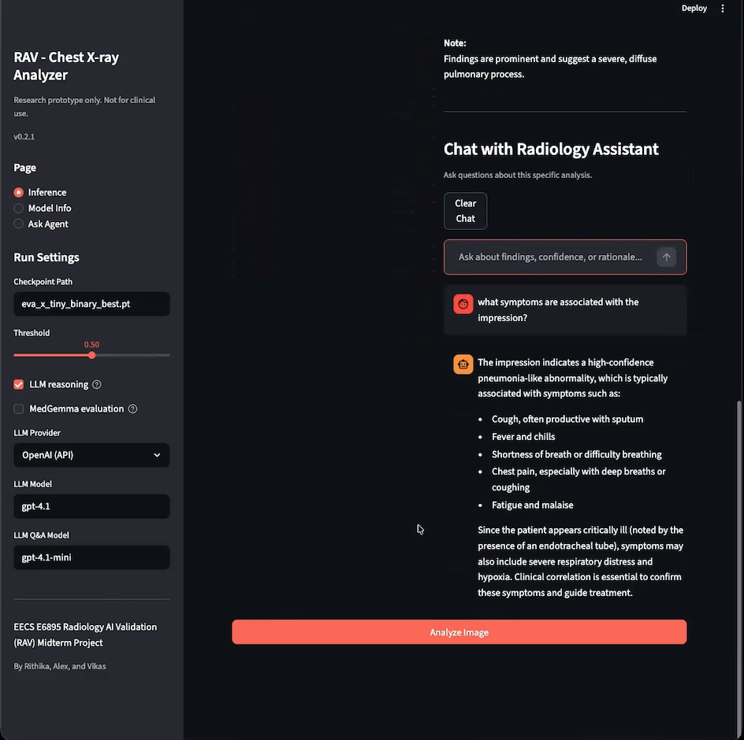

# Project RAV — A Multi-Agent Radiology Assistant for Chest X-Ray Abnormality Detection

**EECS E6895: Big Data Analytics — Midterm Project, Columbia University, 2026**

Rithika Devarakonda, Wei Alexander Xin, Vikas Chelur

> Research prototype only. Not for clinical use.

## Overview

A multi-agent pipeline for detecting abnormalities in chest X-ray images. The system integrates a vision-based binary classifier, a reasoning large language model (LLM), and an automated evaluation agent. The classifier detects abnormal chest X-rays — specifically pneumonia — using a fine-tuned EVA-X Tiny Vision Transformer. When abnormalities are detected, a reasoning LLM generates radiologic findings and explanations. An evaluation agent then assesses the quality of the reasoning output using clinical criteria.

The three-stage architecture:

1. **Classification Agent** — EVA-X Tiny ViT fine-tuned on the [Kaggle Chest X-Ray Pneumonia](https://www.kaggle.com/datasets/paultimothymooney/chest-xray-pneumonia/data) dataset. Outputs p_abnormal via sigmoid activation.
2. **Reasoning Agent** — When p_abnormal > 0.5, a vision-language model generates radiologic findings using confidence-tiered prompting (borderline / moderate / high).
3. **Evaluation Agent** — MedGemma scores the reasoning output on correctness, relevance, safety, and completeness (1–5 scale). BLEU/ROUGE metrics provide quantitative comparison.

<p align="center">
  
</p>

## Results

Results from the final paper ([Project RAV - EECS 6895 Advanced AI 2026.pdf](Project%20RAV%20-%20EECS%206895%20Advanced%20AI%202026.pdf)). Classification metrics produced by `Radiology_Assistant_Evaluation.ipynb`; spot checks from `Big_Data_Analytics_Midterm2.ipynb`.

### Classification Performance (60 test images)

| Metric | Value |
|---|---|
| Accuracy | 86.7% |
| Precision | 0.789 |
| Recall | 1.000 |
| F1 Score | 0.882 |
| AUC | 0.9811 |

|  | Pred. Normal | Pred. Pneumonia |
|---|---|---|
| **Normal** | 22 | 8 |
| **Pneumonia** | 0 | 30 |

The classifier achieves perfect recall — all pneumonia cases are detected — while producing some false positives on normal images due to class imbalance in training data (1,912 pneumonia vs. 1,341 normal).

<p align="center">
  
</p>

### Generalization to External Images

| Image Source | Condition | p_abnormal | Prediction |
|---|---|---|---|
| Radiopaedia | Pneumonia | 0.9988 | Abnormal |
| Radiopaedia | Normal chest | 0.0865 | Normal |
| Physio-pedia | Bronchitis (OOD) | 0.9405 | Abnormal |
| Radiology.ca | Tuberculosis (OOD) | 0.9986 | Abnormal |
| CU Anschutz | Lung cancer (OOD) | 0.9490 | Abnormal |
| Getty Images | Normal (external) | 0.4394 | Normal |

Out-of-distribution pathologies (TB, lung cancer, bronchitis) are correctly flagged as abnormal. The model generalizes beyond the training distribution.

### LLM Evaluation

| Metric | Value |
|---|---|
| ROUGE-1 | 0.158 |
| MedGemma Mean Rating | 4.02 / 5 |

MedGemma judge scores correlate with classification correctness — correct predictions received 4–5/5, while false positives received 1/5, validating the evaluation agent's ability to catch reasoning failures.

## Agent Design

### Classification Agent

- **Backbone**: EVA-X Tiny ViT (patch size 16, embed dim 192, 12 blocks, 3 heads, SwiGLU MLP, RoPE)
- **Head**: `nn.Linear(192, 1)` for binary classification
- **Fine-tuning**: Freezes backbone, unfreezes last block (`blocks.11`), `norm`, `fc_norm`, and `head`
- **Training**: AdamW (lr=1e-4), BCEWithLogitsLoss (pos_weight=0.70), early stopping (patience=4)
- **Best checkpoint**: Epoch 12/13, val_loss=0.0313

EVA-X model code is derived from [hustvl/EVA-X](https://github.com/hustvl/EVA-X), pretrained via Masked Image Modeling on 520K medical images.

### Reasoning Agent

Confidence-tiered prompting based on p_abnormal:

| p_abnormal | Tier | Behavior |
|---|---|---|
| <= 0.5 | Normal | LLM not invoked |
| 0.5 - 0.7 | Borderline | Emphasizes uncertainty, subtle findings |
| 0.7 - 0.8 | Moderate | Standard findings + short differential |
| > 0.8 | High | Dominant patterns, 2-3 likely explanations |

Default backend: [Llama-3.2-11B-Vision-Radiology-mini](https://huggingface.co/0llheaven/Llama-3.2-11B-Vision-Radiology-mini) (local GPU). Optional: OpenAI GPT-4.1 (API).

### Evaluation Agent

[MedGemma](https://huggingface.co/google/medgemma-1.5-4b-it) scores responses on four criteria (correctness, relevance, safety, completeness) on a 1–5 scale. Loaded with 4-bit quantization to fit GPU memory. BLEU and ROUGE provide automated textual metrics.

## Streamlit UI

The recommended way to interact with the project. Three pages:

- **Inference** — Upload a chest X-ray, run the classifier, optionally invoke the LLM for radiologic findings. MedGemma evaluation is available as a sidebar toggle.
- **Model Info** — Checkpoint metadata and class mappings
- **Ask Agent** — Q&A chatbot grounded in the inference report context

### Inference — Abnormal Detection with LLM Reasoning

<p align="center">
  
</p>

<p align="center">
  
</p>

### Inference — Normal Classification

<p align="center">
  
</p>

### Q&A Chat Agent

<p align="center">
  
</p>

## Running the Project

### Streamlit UI

```bash
pip install -r requirements.txt                # core deps (classifier + OpenAI)
pip install -r requirements-llama.txt          # optional: local Llama backend (GPU)
pip install -r requirements-chexagent.txt      # optional: CheXagent backend (GPU)
streamlit run app/streamlit_app.py
```

**Sidebar settings:**
- **LLM Provider**: Llama (local GPU) or OpenAI (API, requires `OPENAI_API_KEY`)
- **MedGemma evaluation**: Optional toggle (requires GPU + HuggingFace gated access)
- LLM features are optional — the EVA-X classifier works without them

### CLI Scripts

Train the binary classifier:

```bash
python -m src.train \
  --data-dir ./chest_xray \
  --pretrained-weights ./eva_x_tiny_patch16_merged520k_mim.pt \
  --checkpoint-dir ./checkpoints
```

Run diagnosis (classifier + LLM reasoning):

```bash
python -m src.diagnose \
  --image ./test_image.jpeg \
  --checkpoint ./eva_x_tiny_binary_best.pt \
  --backend llama
```

### Colab Notebooks

- `Big_Data_Analytics_Midterm_Project.ipynb` — Training + CheXagent inference
- `Big_Data_Analytics_Midterm2.ipynb` — Llama inference with confidence-tiered prompting
- `Radiology_Assistant_Evaluation.ipynb` — End-to-end evaluation with MedGemma judge

## Project Layout

```
app/streamlit_app.py              Streamlit UI (inference, chat, evaluation)
src/rav/                          Core Python package
  models.py, pipeline.py          EVA-X loading, inference
  llm.py                          LLM backends (Llama, CheXagent, OpenAI)
  training.py                     Trainer, datasets, transforms
  metrics.py                      Evaluation metrics (accuracy, AUROC, etc.)
  qa_evaluator.py                 QA evaluation (MedGemma judge + BLEU/ROUGE)
  evaluation.py                   MedGemma judge for Streamlit
  reporting.py, utils.py          Reporting and shared utilities
src/train.py                      CLI: classifier training
src/diagnose.py                   CLI: classifier + LLM diagnosis
scripts/                          Smoke test, evaluation, test data generation
eva_x.py                          EVA-X model definitions (notebook compat)
*.ipynb                           Colab notebooks (training, inference, evaluation)
```

## Model Assets

| Asset | Source |
|---|---|
| EVA-X pretrained weights | [MapleF/eva_x](https://huggingface.co/MapleF/eva_x/blob/main/eva_x_tiny_patch16_merged520k_mim.pt) |
| Trained checkpoint | `eva_x_tiny_binary_best.pt` (included) |
| Llama radiology model | [0llheaven/Llama-3.2-11B-Vision-Radiology-mini](https://huggingface.co/0llheaven/Llama-3.2-11B-Vision-Radiology-mini) |
| MedGemma judge | [google/medgemma-1.5-4b-it](https://huggingface.co/google/medgemma-1.5-4b-it) |
| Dataset | [Kaggle Chest X-Ray Pneumonia](https://www.kaggle.com/datasets/paultimothymooney/chest-xray-pneumonia/data) |

## Environment Variables

| Variable | Required for |
|---|---|
| `OPENAI_API_KEY` | OpenAI LLM provider in Streamlit UI |
| `HF_TOKEN` | Downloading gated models (MedGemma) |
| `KAGGLE_USERNAME` / `KAGGLE_KEY` | Downloading dataset for evaluation |

## Acknowledgments

We acknowledge the use of AI tools, including ChatGPT and Claude, during the development of this project.
